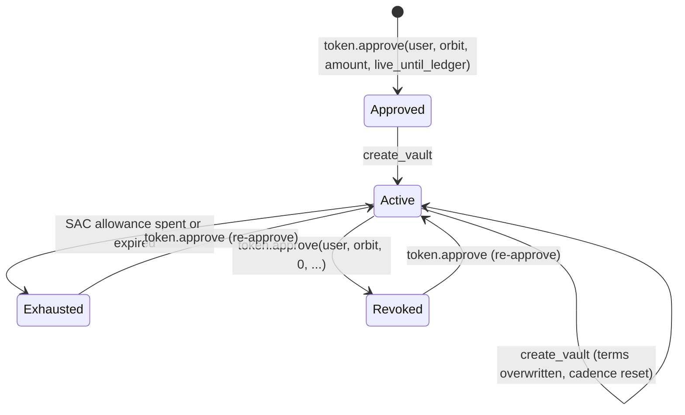
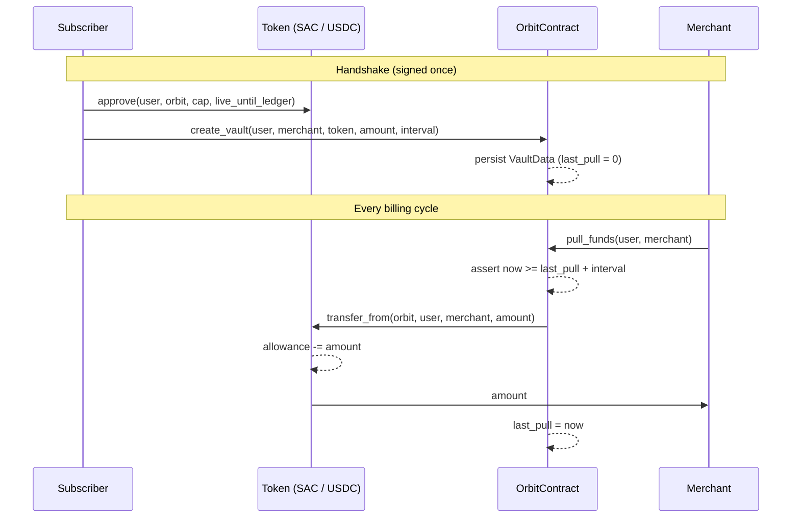

# Orbit Protocol (Soroban Pull Payments)

> Non-custodial recurring billing and atomic batch payroll on Stellar: funds move only when the contract can prove the billing interval has elapsed and the subscriber has signed the allowance.

[](https://stellar.org)
[](contracts/soroban/Cargo.toml)
[](https://rustup.rs)
[](contracts/soroban/src/test.rs)
[](apps/frontend/package.json)
[](https://stellar.expert/explorer/testnet/contract/CAZBZBUWBSQYK2RZ6WHMXVDLIQHSU5WD7ANZYL6HLNSCRUOTNYCDYQNG)
[](#15-license)

**Live app:** [orbit-lemon-mu.vercel.app](https://orbit-lemon-mu.vercel.app/)

---

## Overview

Orbit is a **pull-payment protocol** for Web3 commerce. A subscriber signs once, and the merchant can then bill a fixed USDC amount per interval without asking the subscriber to approve every charge. The subscriber's funds never leave their wallet until a valid pull happens.

The contract does not hold subscriber funds. It keeps billing terms in storage and uses the Stellar Asset Contract (SAC) allowance model (`approve` / `transfer_from`) to move tokens directly from subscriber to merchant.

The same contract also exposes **batch payroll**: one signed transaction pays many recipients, and if any transfer fails, the whole batch reverts.

---

## Vault Lifecycle



Key rules:
- **Approved**: the subscriber grants the Orbit contract a SAC allowance. This is the only step that lets tokens move. It is bounded by an amount and a `live_until_ledger`.
- **Active**: `create_vault` records the terms (`token`, `amount_per_interval`, `interval_seconds`) under the `(user, merchant)` key. No tokens move.
- **Active -> Active (pull)**: only the merchant can call `pull_funds`. The first pull is allowed right away. Later pulls need `ledger.timestamp() >= last_pull_timestamp + interval_seconds`.
- **Exhausted / Revoked**: the SAC rejects `transfer_from` once the allowance runs out, expires, or is set to 0. Orbit has no separate revoke entrypoint. The token allowance is the kill switch.

See [Docs/ARCHITECTURE.md](Docs/ARCHITECTURE.md) for the full system design.

---

## Contract Functions

| Function | Auth | Description |
|---|---|---|
| `create_vault(user, merchant, token, amount_per_interval, interval_seconds)` | user | Writes `VaultData` for `(user, merchant)`. Sets `last_pull_timestamp = 0`. Moves no funds. |
| `pull_funds(user, merchant)` | merchant | Checks the interval, calls `transfer_from(orbit, user, merchant, amount_per_interval)`, then saves `last_pull_timestamp = now`. |
| `batch_disburse(sender, token, splits)` | sender | Calls `transfer_from(orbit, sender, split.recipient, split.amount)` for each split, all in one invocation. |

---

## Data Structures

```rust
#[contracttype]
pub struct VaultKey {
    pub user: Address,             // subscriber (token owner)
    pub merchant: Address,         // only address allowed to pull
}

#[contracttype]
pub struct VaultData {
    pub token: Address,            // SEP-41 / SAC token (USDC, 7 decimals)
    pub amount_per_interval: i128, // raw units pulled per cycle
    pub interval_seconds: u64,     // minimum gap between pulls
    pub last_pull_timestamp: u64,  // ledger timestamp of last pull (0 = never)
}

#[contracttype]
pub struct PaymentSplit {
    pub recipient: Address,        // payroll recipient
    pub amount: i128,              // raw units to send
}
```

---

## Getting Started

### Prerequisites

- Rust (stable) with the `wasm32v1-none` target (`rustup target add wasm32v1-none`)
- [Stellar CLI](https://developers.stellar.org/docs/tools/stellar-cli)
- Node.js 18+ and npm 9+

### Build & Test

```bash
cd contracts/soroban

# Run the unit tests (mock Env, mocked auths, mock SAC)
cargo test

# Build the WASM
stellar contract build
# -> target/wasm32v1-none/release/orbit_contract.wasm
```

### Deploy to Testnet

```bash
cd scripts
./deploy.sh          # builds, creates identity "alice", deploys, writes .contract_id
./execute_flow.sh    # end-to-end: approve -> create_vault -> pull_funds -> batch_disburse
```

`execute_flow.sh` uses the testnet native-asset SAC (wrapped XLM) as a stand-in for USDC, so it runs without a USDC trustline.

### Invoke Examples

```bash
# 1. Subscriber approves the Orbit contract on the token (SAC)
stellar contract invoke \
  --id $TOKEN --source subscriber --network testnet -- \
  approve \
  --from $USER_ADDR \
  --spender $ORBIT_CONTRACT \
  --amount 500000000 \
  --live_until_ledger 5000000

# 2. Subscriber creates the vault (29 USDC every 30 days)
stellar contract invoke \
  --id $ORBIT_CONTRACT --source subscriber --network testnet -- \
  create_vault \
  --user $USER_ADDR \
  --merchant $MERCHANT_ADDR \
  --token $TOKEN \
  --amount_per_interval 290000000 \
  --interval_seconds 2592000

# 3. Merchant pulls the current cycle
stellar contract invoke \
  --id $ORBIT_CONTRACT --source merchant --network testnet -- \
  pull_funds \
  --user $USER_ADDR \
  --merchant $MERCHANT_ADDR

# 4. Payroll: one transaction, many recipients
stellar contract invoke \
  --id $ORBIT_CONTRACT --source merchant --network testnet -- \
  batch_disburse \
  --sender $MERCHANT_ADDR \
  --token $TOKEN \
  --splits '[{"recipient":"'$ALICE'","amount":"100000000"},{"recipient":"'$BOB'","amount":"50000000"}]'
```

### Run the App

```bash
npm --prefix apps/frontend install
npm run dev              # Merchant Control Center on http://localhost:3000
npm run typecheck

cp apps/backend/.env.example apps/backend/.env   # fill in Supabase keys
npm --prefix apps/backend install
npm run dev:backend      # Merchant API on http://localhost:3001

cd packages/checkout-widget && npm install && npm run dev   # widget on http://localhost:5173
```

---

## Table of Contents

- [1. What is this project?](#1-what-is-this-project)
- [2. Who are the actors?](#2-who-are-the-actors)
- [3. Trust model](#3-trust-model)
- [4. Billing lifecycle in practice](#4-billing-lifecycle-in-practice)
- [5. Contract architecture](#5-contract-architecture)
  - [5.1 Contract entrypoints](#51-contract-entrypoints)
  - [5.2 Storage model](#52-storage-model)
  - [5.3 Token flow (SAC allowance)](#53-token-flow-sac-allowance)
- [6. Batch payroll](#6-batch-payroll)
- [7. Off-chain system](#7-off-chain-system)
  - [7.1 Merchant Control Center](#71-merchant-control-center)
  - [7.2 Merchant API](#72-merchant-api)
  - [7.3 Checkout Widget SDK](#73-checkout-widget-sdk)
- [8. Deployed contract registry](#8-deployed-contract-registry)
- [9. Error model](#9-error-model)
- [10. Security considerations](#10-security-considerations)
- [11. Testing strategy](#11-testing-strategy)
- [12. Repository layout](#12-repository-layout)
- [13. Roadmap](#13-roadmap)
- [14. Contributing](#14-contributing)
- [15. License](#15-license)

---

## 1. What is this project?

Stablecoins settle fast, but web3 has no clean way to handle recurring payments. The usual choices are:

- ask the user to sign every month (people forget, so subscriptions churn), or
- lock the user's funds in an escrow up front (capital sits idle, and you have to trust the custodian).

Orbit separates **authorization** from **custody**:

- the subscriber keeps the tokens in their own wallet,
- the subscriber sets a spending ceiling on the token itself (SAC allowance),
- the Orbit contract enforces how often the merchant can pull and how much each pull takes.

A merchant can therefore bill on schedule without ever holding, or being able to reach, more than the subscriber approved.

---

## 2. Who are the actors?

1. **Subscriber (user)**
   - Approves the Orbit contract on the token.
   - Calls `create_vault` to agree to billing terms with one merchant.
   - Can stop billing at any time by setting the token allowance to 0.

2. **Merchant**
   - The only address that can call `pull_funds` for its vaults.
   - Runs payroll through `batch_disburse`.
   - Manages plans, subscribers and payouts in the Merchant Control Center.

3. **Payroll sender**
   - Any address that approves Orbit on a token and signs `batch_disburse`. In practice this is the merchant's treasury.

4. **Recipients**
   - Wallets that receive `PaymentSplit` amounts. They sign nothing.

5. **Keeper / backend**
   - The Merchant API can build, sign and submit `pull_funds` for the merchant on schedule (`POST /trigger-pull`).

There is **no admin role** in the contract. It has no pause flag, no fees and no upgrade key.

---

## 3. Trust model

Orbit keeps trust small and states it explicitly:

- **Subscribers trust the token allowance, not the merchant.** The most a merchant can ever take is capped by the SAC allowance the subscriber set (both the amount and the `live_until_ledger`).
- **Subscribers trust the contract cadence check.** Within that allowance, the contract allows at most one `amount_per_interval` pull per `interval_seconds`, measured by `env.ledger().timestamp()`.
- **Merchants trust the ledger for settlement.** A successful `pull_funds` means tokens have moved. There is no off-chain settlement step.
- **The backend is a convenience, not a custodian.** It never holds user funds. It only submits merchant-signed transactions.

---

## 4. Billing lifecycle in practice

1. **Approval**
   - The subscriber calls `approve(from = user, spender = orbit, amount, live_until_ledger)` on the token.
   - Setting `amount` to N x `amount_per_interval` allows N cycles.

2. **Vault creation**
   - `create_vault` requires `user.require_auth()`.
   - It writes `VaultData` under `VaultKey { user, merchant }` in persistent storage.
   - `last_pull_timestamp = 0`.

3. **First pull**
   - `pull_funds` requires `merchant.require_auth()`.
   - Since `last_pull_timestamp == 0`, the interval check is skipped and the first cycle is billed right away.

4. **Recurring pulls**
   - The contract asserts `now >= last_pull_timestamp + interval_seconds`.
   - It calls `transfer_from(spender = orbit, from = user, to = merchant, amount_per_interval)`.
   - `last_pull_timestamp` is saved only after the transfer succeeds. A failed transfer reverts the whole invocation, so the cadence clock does not advance.

5. **Stopping**
   - The subscriber sets the allowance to 0, or lets it expire. Any later `pull_funds` fails inside the SAC.

---

## 5. Contract architecture

### 5.1 Contract entrypoints

The contract is a single `no_std` crate:

- `contracts/soroban/src/lib.rs`: `#[contract] pub struct OrbitContract;` and its `#[contractimpl]`
- `contracts/soroban/src/test.rs`: unit tests

Each state-changing method follows the same pattern:

1. `require_auth()` on the one address that owns the action,
2. load state from persistent storage (for pulls),
3. check the time guard,
4. move tokens through `soroban_sdk::token::Client`,
5. save the updated state.

### 5.2 Storage model

| Key | Storage | Value | Written by |
|---|---|---|---|
| `VaultKey { user, merchant }` | persistent | `VaultData` | `create_vault`, `pull_funds` |

There is one vault per `(user, merchant)` pair. Calling `create_vault` again for the same pair overwrites the terms and resets `last_pull_timestamp` to 0.

`batch_disburse` is stateless: it writes nothing to storage.

### 5.3 Token flow (SAC allowance)



Orbit is the **spender** in every `transfer_from`. Tokens always go straight from `user` to `merchant` (or from `sender` to `recipient`), and the contract's own balance is never used.

---

## 6. Batch payroll

`batch_disburse(sender, token, splits: Vec<PaymentSplit>)`:

- requires `sender.require_auth()`,
- loops over `splits` and runs one `transfer_from(orbit, sender, recipient, amount)` for each,
- runs all of it inside a single Soroban invocation.

$$\text{TotalDisbursed} = \sum_{i=1}^{N} \text{splits}[i].\text{amount} \le \text{allowance}(\text{sender}, \text{orbit})$$

If any transfer fails (not enough balance, allowance exceeded, bad recipient), the host rolls back every earlier transfer in the batch. Recipients never see a half-paid payroll.

The dashboard's Batch Payroll module parses a CSV on the client, checks each line as a Stellar public key, and builds the `splits` vector.

---

## 7. Off-chain system

```
+-------------------------------------------------------------+
|  apps/frontend (Next.js 15)     packages/checkout-widget    |
|  Merchant Control Center        <OrbitCheckout /> (Vite)    |
|  /pay/[id] hosted checkout      Freighter handshake         |
+------------------------------+------------------------------+
                               |
                               v
+-------------------------------------------------------------+
|  apps/backend (Express + Supabase)                          |
|  plans / subscriptions / subscribers / trigger-pull         |
+------------------------------+------------------------------+
                               |  @stellar/stellar-sdk (RPC)
                               v
+-------------------------------------------------------------+
|  Soroban testnet: OrbitContract.wasm + SAC token            |
+-------------------------------------------------------------+
```

### 7.1 Merchant Control Center

`apps/frontend`, Next.js 15 App Router, React 19, Tailwind 4.

| Route | Purpose |
|---|---|
| `/` | Protocol overview and use-case carousel |
| `/dashboard` | Overview and Settlement Treasury Vault (Freighter), plans, subscribers, batch payroll, payment links, developer portal |
| `/pay/[id]` | Hosted checkout for a plan |
| `/docs` | Integration docs |
| `/pricing`, `/get-started`, `/signin`, `/signup` | Marketing and auth |

Freighter is detected and connected through the official `@stellar/freighter-api` (`src/lib/freighter.ts`), not through `window` globals.

### 7.2 Merchant API

`apps/backend/index.js` (Express). Data lives in Supabase (`apps/backend/schema.sql`: `merchants`, `plans`, `subscriptions`).

| Method | Path | Description |
|---|---|---|
| `POST` | `/plans` | Create a plan (`merchant_id`, `name`, `usdc_amount`, `interval_seconds`) |
| `GET` | `/plans/:id` | Plan and merchant details for checkout |
| `POST` | `/subscriptions` | Record a subscription after the on-chain handshake |
| `GET` | `/subscribers?merchant_id=` | Subscriptions across a merchant's plans |
| `POST` | `/trigger-pull` | Build, simulate (`prepareTransaction`), sign and submit `pull_funds` |

Environment: see `apps/backend/.env.example` (`ORBIT_CONTRACT_ID`, `SOROBAN_RPC_URL`, `STELLAR_NETWORK_PASSPHRASE`, Supabase keys).

### 7.3 Checkout Widget SDK

`packages/checkout-widget`: the `<OrbitCheckout />` React component, built with Vite. It connects Freighter and runs the `approve` + `create_vault` handshake from any merchant site.

---

## 8. Deployed contract registry

| Parameter | Value |
| :--- | :--- |
| **Orbit Contract ID** | [`CAZBZBUWBSQYK2RZ6WHMXVDLIQHSU5WD7ANZYL6HLNSCRUOTNYCDYQNG`](https://stellar.expert/explorer/testnet/contract/CAZBZBUWBSQYK2RZ6WHMXVDLIQHSU5WD7ANZYL6HLNSCRUOTNYCDYQNG) |
| **Network** | Stellar Testnet |
| **Network Passphrase** | `Test SDF Network ; September 2015` |
| **Soroban RPC** | `https://soroban-testnet.stellar.org` |
| **Settlement Asset** | USDC via SAC (7 decimals) |

---

## 9. Error model

The contract currently fails with host panics, not typed `contracterror` codes:

| Source | Condition | Message |
|---|---|---|
| `pull_funds` | no vault for `(user, merchant)` | `Vault does not exist` |
| `pull_funds` | `now < last_pull + interval` | `Too early to pull funds` |
| any method | missing signature | host auth error |
| SAC `transfer_from` | allowance too low or expired | token contract error |
| SAC `transfer_from` | balance too low | token contract error |

Clients should simulate first (the backend does this with `prepareTransaction`) and show the simulation error before asking for a signature.

---

## 10. Security considerations

### 10.1 Authorization boundaries

- `create_vault`: only the subscriber can set their own terms.
- `pull_funds`: only the merchant named in the key can pull. A third party cannot trigger another merchant's vault.
- `batch_disburse`: only the sender can spend their own allowance.

### 10.2 Non-custodial invariant

The contract never holds a balance. The most any merchant can ever take is `min(SAC allowance, subscriber balance)`, and the subscriber can drop it to zero at any time.

### 10.3 Time and replay safety

- Cadence uses `env.ledger().timestamp()`, never a timestamp supplied by the caller.
- `last_pull_timestamp` is updated in the same invocation as the transfer, so two pulls in one interval are impossible.

### 10.4 Atomicity

A Soroban invocation is all or nothing. A failed transfer in `pull_funds` or `batch_disburse` reverts every state change and every earlier transfer.

### 10.5 Reentrancy

Soroban does not allow a contract to re-enter itself, and the only external call is to the SAC. State is written after the transfer, but a reentrant call to Orbit is not possible.

### 10.6 Arithmetic

The release profile sets `overflow-checks = true`. The one addition (`last_pull_timestamp + interval_seconds`) aborts instead of wrapping.

### 10.7 Known limitations (MVP)

- `create_vault` does not validate that `amount_per_interval > 0` or `interval_seconds > 0`. A zero interval turns the vault into "pull whenever", still capped by the allowance.
- Re-calling `create_vault` resets `last_pull_timestamp` to 0, which enables an immediate pull. Only the subscriber can do this, but clients should warn them.
- `batch_disburse` does not reject zero or negative amounts. The SAC rejects negative amounts.
- The contract emits no events. Indexers have to rely on transaction results and SAC transfer events.
- `POST /trigger-pull` accepts `merchant_secret` in the request body. That is fine for testnet demos only. Production should sign on the client (Freighter) or with a KMS-held key.

> This contract has not been audited. It runs on testnet only.

---

## 11. Testing strategy

`contracts/soroban/src/test.rs`:

| Test | What it verifies |
|---|---|
| `test_allowance_handshake_and_pull` | Mints 100 USDC to the user, approves Orbit, creates a 29 USDC / 30 day vault, pulls once, and asserts merchant = `29_0000000` and user = `71_0000000` |

```
running 1 test
test test::test_allowance_handshake_and_pull ... ok
test result: ok. 1 passed; 0 failed
```

End-to-end coverage on the real testnet comes from `scripts/execute_flow.sh`.

---

## 12. Repository layout

```
Orbit/
├── contracts/soroban/          # OrbitContract (Rust, no_std, soroban-sdk 27)
│   └── src/{lib.rs,test.rs}
├── apps/
│   ├── frontend/               # Next.js 15 Merchant Control Center
│   └── backend/                # Express + Supabase Merchant API
├── packages/checkout-widget/   # <OrbitCheckout /> React SDK (Vite)
├── scripts/                    # deploy.sh, execute_flow.sh
├── Docs/                       # ARCHITECTURE, MVP_SPEC, Brand, Build_Guide
└── package.json                # workspace scripts (dev, build, typecheck)
```

---

## 13. Roadmap

- [x] Allowance vaults with ledger-time cadence
- [x] Merchant-authorized `pull_funds`
- [x] Atomic `batch_disburse` payroll
- [x] Merchant Control Center and hosted checkout
- [x] Freighter integration
- [ ] Typed `contracterror` codes instead of string panics
- [ ] Contract events (`VaultCreated`, `FundsPulled`, `BatchDisbursed`)
- [ ] Input validation on `create_vault` and `batch_disburse`
- [ ] `cancel_vault` entrypoint and TTL extension for vault entries
- [ ] Broader test suite (early pull, missing vault, batch rollback)
- [ ] Keeper service with client-side signing
- [ ] Security audit and mainnet deployment

---

## 14. Contributing

- `cargo fmt` and `cargo clippy -- -D warnings` in `contracts/soroban`
- `cargo test` must pass
- `npm run typecheck` must pass for `apps/frontend`
- Use conventional commit messages (`feat(scope): ...`, `fix(scope): ...`)

---

## 15. License

MIT. Orbit Contributors.
